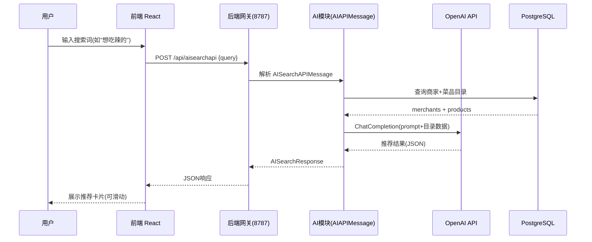

## 产品概述

为外卖平台添加 AI 智能搜索功能，用户可通过自然语言描述需求（如"想吃辣的""适合聚会的"），由后端调用 OpenAI ChatGPT 匹配商家并推荐菜品组合，前端在顾客首页展示搜索栏和可左右滑动的结果卡片。

## 核心功能

- **AI 搜索入口**：顾客端首页 HomeTab 顶部增加 AI 搜索栏，输入自然语言查询后触发搜索
- **后端 AI 服务**：新增 `ai` 模块，代理调用 OpenAI ChatGPT API，将商家和菜品目录数据注入 prompt，返回匹配的商家和推荐菜品组合
- **结果展示**：前端展示 AI 推荐结果卡片，包含商家信息和推荐菜品，支持左右滑动浏览菜品推荐
- **超时重试**：30s 超时，最多重试 3 次，全部失败后友好提示用户
- **可扩展架构**：后端 AI 模块设计为共享服务，便于后续商家端和用户端增加其他 AI 功能

## 技术栈

- 后端：Scala 3 + http4s + Circe（沿用现有），新增 `http4s-client` 依赖用于调用 OpenAI API
- 前端：Vite + React + Zustand + shadcn/ui + Tailwind CSS（沿用现有）
- AI 调用：后端代理 OpenAI Chat Completions API，环境变量 `OPENAI_API_KEY` 配置密钥

## 技术架构

### 系统架构



### 模块划分

- **后端 AI 模块** (`backend/src/ai/`)：独立的 `ai` 域，包含 `api/`、`objects/`、`routes/`、`utils/` 四层，遵循现有模块结构
- `ai/api/AIAPIMessages.scala`：定义 `AISearchAPIMessage`，继承 `APIMessage`，执行搜索逻辑
- `ai/objects/AISearchRequest.scala`：请求体 case class
- `ai/objects/AISearchResponse.scala`：响应体 case class（含推荐商家和菜品列表）
- `ai/routes/AIRoutes.scala`：注册 AI 相关 API
- `ai/utils/OpenAIClient.scala`：封装 OpenAI HTTP 调用、超时重试、响应解析
- **前端 AI API** (`frontend/src/api/ai/`)：与后端 `ai/api/` 一一对应
- `AISearchApi.ts`：定义 `AISearchAPI` 消息类，调用 `sendAPI`
- **前端 AI Objects** (`frontend/src/objects/ai/`)：与后端 `ai/objects/` 一一对应
- `AISearchRequest.ts`：请求 interface
- `AISearchResponse.ts`：响应 interface（含推荐商家和菜品）
- **前端 AI 搜索组件**：HomeTab 中新增搜索栏和结果展示

### 数据流

1. 用户在 HomeTab 搜索栏输入查询 → 前端构造 `AISearchAPI` 消息
2. `sendAPI` 发送 `POST /api/aisearchapi` 到网关
3. 网关路由到 `AISearchAPIMessage.plan()` → 从 DB 查询商家/菜品目录 → 构造 prompt → 调用 OpenAI
4. OpenAI 返回结构化推荐 → 后端解析为 `AISearchResponse` → 返回前端
5. 前端渲染推荐结果卡片，支持左右滑动浏览菜品

## 实现细节

### 核心目录结构（新增/修改部分）

```
backend/src/
├── ai/
│   ├── api/
│   │   └── AIAPIMessages.scala       # 新增: AISearchAPIMessage
│   ├── objects/
│   │   ├── AISearchRequest.scala     # 新增: 搜索请求体
│   │   └── AISearchResponse.scala    # 新增: 搜索响应体
│   ├── routes/
│   │   └── AIRoutes.scala            # 新增: AI API 注册
│   └── utils/
│       └── OpenAIClient.scala        # 新增: OpenAI HTTP 客户端+重试
├── shared/
│   └── json/
│       └── ApiJsonCodecs.scala       # 修改: 添加 AI objects Codec
└── DeliveryRoutes.scala              # 修改: 添加 AIRoutes.apiMessages

frontend/src/
├── api/
│   └── ai/
│       └── AISearchApi.ts            # 新增: AI 搜索 API 调用
├── objects/
│   └── ai/
│       ├── AISearchRequest.ts        # 新增: 搜索请求 interface
│       └── AISearchResponse.ts       # 新增: 搜索响应 interface
├── components/
│   ├── AISearchBar.tsx               # 新增: AI 搜索栏组件
│   └── AISearchResults.tsx           # 新增: AI 结果展示(含滑动)
└── pages/
    └── CustomerPortal/
        └── HomeTab.tsx               # 修改: 集成 AISearchBar + AISearchResults
```

### 关键数据结构

**后端请求/响应**：

```
// AISearchRequest.scala
final case class AISearchRequest(query: String)

// AISearchResponse.scala
final case class AIRecommendedProduct(
  productId: String,
  productName: String,
  price: Double,
  reason: String
)
final case class AIRecommendedMerchant(
  merchantId: String,
  storeName: String,
  category: String,
  reason: String,
  products: List[AIRecommendedProduct]
)
final case class AISearchResponse(
  query: String,
  merchants: List[AIRecommendedMerchant],
  summary: String
)
```

**前端请求/响应**（与后端一一对应）：

```typescript
// AISearchRequest.ts
export interface AISearchRequest { query: string }

// AISearchResponse.ts
export interface AIRecommendedProduct {
  productId: string; productName: string; price: number; reason: string
}
export interface AIRecommendedMerchant {
  merchantId: string; storeName: string; category: string; reason: string;
  products: AIRecommendedProduct[]
}
export interface AISearchResponse {
  query: string; merchants: AIRecommendedMerchant[]; summary: string
}
```

### 关键实现方案

**OpenAI 调用与重试**：

1. `OpenAIClient` 使用 `http4s-client` 发起 POST 请求到 `https://api.openai.com/v1/chat/completions`
2. 将商家/菜品目录序列化为 JSON 注入 system prompt，要求 AI 以指定 JSON schema 返回推荐结果
3. 30s 超时通过 `IO.race` + `IO.sleep` 实现，最多重试 3 次
4. 全部失败返回友好错误信息，不暴露内部异常
5. `OPENAI_API_KEY` 从环境变量读取，缺失时启动日志告警，调用时返回明确错误

**APIMessage 集成**：

- `AISearchAPIMessage` 继承 `APIMessage[AISearchResponse]`，无需 `Connection`（AI 模块直接查询后构造 prompt）
- 但需在 `plan` 内部使用 `DatabaseSession.withTransactionConnection` 查询目录数据
- 注册到 `AIRoutes.apiMessages`，最终汇入 `DeliveryRoutes`

**前端搜索交互**：

- 搜索栏防抖 500ms，避免频繁调用
- 加载态展示骨架屏/加载动画
- 错误态展示重试按钮
- 结果区域用 CSS `overflow-x-auto` + `scroll-snap` 实现左右滑动
- 点击推荐商家可跳转到商家点餐页

### 技术考量

- **安全性**：OpenAI API Key 仅存于后端环境变量，前端不可见；AI prompt 注入防御通过限制输出 schema 实现
- **性能**：商家/菜品目录数据可能较大，注入 prompt 前做精简（只传关键字段）；后续可考虑缓存 AI 响应
- **可扩展性**：`ai` 模块独立于现有域，后续新增 AI 功能只需在 `AIAPIMessages.scala` 和 `AIRoutes.scala` 中添加新的 APIMessage

## 设计风格

采用现代感强的 Glassmorphism 风格，与现有 HomeTab 的渐变 hero 区域自然融合。AI 搜索栏使用玻璃质感面板，带有微妙的模糊背景和发光边框，突出 AI 功能的科技感。

## 页面设计

### 顾客首页 HomeTab（修改后）

页面从上到下分为 4 个区块：

1. **AI 搜索栏区块**（新增，位于 hero 区域下方）：玻璃质感圆角面板，左侧 Sparkles 图标 + 占位符"描述你想吃的..."，输入后右侧出现搜索/清除按钮，加载态显示脉冲动画。底部有微光渐变边框。

2. **AI 结果展示区块**（新增，搜索后出现）：每个推荐商家为一张卡片，包含商家名、分类标签、AI 推荐理由。卡片内菜品推荐区域水平排列，支持左右滑动（scroll-snap），每张菜品小卡展示菜品图、名称、价格和推荐理由摘要。

3. **Hero 区域**（保留现有）：今日精选 + 发现附近好味道，保持不变。

4. **商家列表**（保留现有）：原有商家列表，保持不变。

### 交互设计

- 搜索栏获焦时边框渐变发光，输入 500ms 防抖后自动搜索
- 加载中：搜索栏右侧旋转加载图标 + 结果区骨架屏
- 错误态：结果区展示错误信息 + 重试按钮
- 空态：无结果时展示友好提示
- 菜品卡片水平滑动，带 scroll-snap 对齐
- 推荐商家卡片 hover 时轻微上浮 + 阴影增强
- 点击商家可跳转商家详情页

## Agent Extensions

### Skill

- **type-safety-audit**
- Purpose: 完成开发后审计前后端类型安全一致性，验证 AI 模块的 API/objects 前后端一一对应
- Expected outcome: 确认 `backend/src/ai/api/` 与 `frontend/src/api/ai/` 文件数量和命名一致；`backend/src/ai/objects/` 与 `frontend/src/objects/ai/` 字段语义对齐；无硬编码字符串替代枚举

### SubAgent

- **code-explorer**
- Purpose: 搜索现有代码中的模式（如 ApiJsonCodecs 注册方式、DeliveryRoutes 集成方式、前端 API 目录结构），确保新增 AI 模块与现有代码风格完全一致
- Expected outcome: 获取精确的文件路径和代码模式，指导 AI 模块的实现与现有架构无缝集成