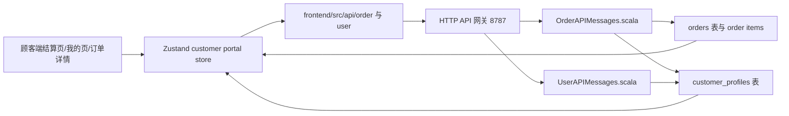
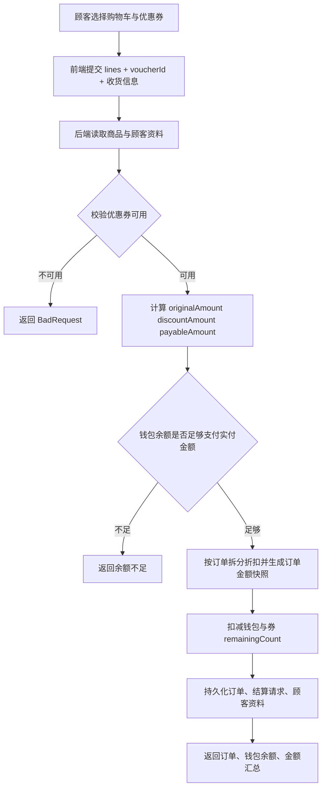

## Product Overview

为顾客端补齐以后端数据为准的优惠券系统和吃货等级系统，让顾客在注册、结算、确认完成订单、查看个人中心和订单详情时，都能看到一致的券、等级、积分与金额信息。

## Core Features

- 新顾客注册后默认成为吃货 1 级、0 积分，并获得 1 张“满30减10”优惠券。
- 顾客在结算页可选择名下可用优惠券；每次结算最多使用 1 张，优惠金额、实付金额、钱包扣款由后端确认。
- 订单确认完成后，按订单实付金额向下取整累计积分；每累计跨过 200 积分提升 1 级。
- 每跨越 1 个等级，自动发放 1 张“满30减10”优惠券；取消订单不发放积分或等级奖励。
- 个人中心展示吃货等级、累计积分、升级进度、可用优惠券列表，并突出即将可用的结算权益。
- 结算页和订单详情展示商品原价、优惠金额、实付金额、使用优惠券与预计/实际积分，避免前后端金额口径不一致。

## Tech Stack

- 后端：Scala 3.3.3、http4s、cats-effect、Circe、PostgreSQL、JSONB。
- 前端：Vite、React 19、TypeScript、Zustand、shadcn/Radix UI、Tailwind CSS。
- 数据原则：继续沿用 shared `Voucher` 概念，不引入第三方服务；所有业务状态以后端持久化为准。
- 约束：后端 Scala 新代码只使用 `val`，不新增 `var`；前后端 `api` 与 `objects` 契约文件保持一一对应。

## Architecture Design

### System Architecture

本次是现有顾客端业务切片增强，复用当前“前端 API 封装 → 网关 → 后端 API Message → 表持久化”的结构，不引入新架构。



### Module Division

- **优惠券与等级规则模块**
- 责任：生成“满30减10”券、校验可用券、计算实付金额、计算积分与升级奖励。
- 建议位置：复用后端现有对象层，可新增轻量工具对象，如 `backend/src/shared/objects` 或贴近订单 API 的私有 helper。
- 依赖：`Voucher`、`CustomerProfile`、`Order`。

- **顾客资料模块**
- 责任：为 `CustomerProfile` 增加 `foodiePoints`、`foodieLevel`，注册与种子数据初始化注册送券。
- 修改点：`CustomerProfile.scala`、`CustomerProfileTable.scala`、`CustomerProfileTableInitializer.scala`、`UserAPIMessages.scala`、`SeedBootstrap.scala`。

- **订单结算模块**
- 责任：结算请求接收 `voucherId`，后端校验券归属、剩余次数、门槛、过期时间，生成金额快照并扣实付金额。
- 修改点：`OrderAPIMessages.scala`、`CheckoutRequest.scala`、`CheckoutResponse.scala`、`Order.scala`、`OrderTable.scala`。

- **前端顾客体验模块**
- 责任：结算页优惠券选择、金额拆分展示；我的页等级进度和券列表；订单详情金额与积分展示。
- 修改点：`use-customer-portal-store.ts`、`CustomerCheckoutPage.tsx`、`ProfileTab.tsx`、`OrderDetailDialog.tsx`。

## Data Flow

### 结算用券流程



### 确认完成与升级流程

```mermaid
flowchart TD
  A[顾客确认订单完成] --> B[后端读取订单与顾客资料]
  B --> C{订单是否已送达且未完成}
  C -- 否 --> D[拒绝重复或非法操作]
  C -- 是 --> E[earnedPoints = floor(order.payableAmount)]
  E --> F[计算 oldLevel 与 nextLevel]
  F --> G[按跨级数量发放优惠券]
  G --> H[订单写入 pointsAwarded 并转入历史]
  H --> I[更新 foodiePoints、foodieLevel、vouchers]
  I --> J[前端刷新我的页、订单详情]
```

## Implementation Details

### Core Directory Structure

仅展示本次会新增或修改的重点文件：

```text
Type-safe_project/
├── backend/src/order/
│   ├── api/OrderAPIMessages.scala
│   ├── objects/
│   │   ├── CheckoutRequest.scala
│   │   ├── CheckoutResponse.scala
│   │   └── Order.scala
│   └── tables/order/
│       ├── OrderTable.scala
│       └── OrderTableInitializer.scala
├── backend/src/user/
│   ├── api/UserAPIMessages.scala
│   ├── objects/CustomerProfile.scala
│   └── tables/customerprofile/
│       ├── CustomerProfileTable.scala
│       └── CustomerProfileTableInitializer.scala
├── backend/src/shared/
│   ├── bootstrap/SeedBootstrap.scala
│   ├── bootstrap/SeedData.scala
│   └── json/ApiJsonCodecs.scala
└── frontend/src/
    ├── api/order/CheckoutApi.ts
    ├── objects/order/
    │   ├── CheckoutRequest.ts
    │   ├── CheckoutResponse.ts
    │   └── Order.ts
    ├── objects/user/CustomerProfile.ts
    ├── stores/pages/use-customer-portal-store.ts
    └── pages/CustomerPortal/
        ├── CustomerCheckoutPage.tsx
        ├── ProfileTab.tsx
        └── OrderDetailDialog.tsx
```

### Key Code Structures

**CustomerProfile 扩展**

```
final case class CustomerProfile(
    id: UserId,
    name: String,
    phone: String,
    defaultAddress: String,
    vouchers: List[Voucher],
    walletBalance: Double,
    pendingOrders: List[Order],
    historyOrders: List[Order],
    deliveryContacts: List[CustomerDeliveryContact] = Nil,
    foodiePoints: Int = 0,
    foodieLevel: Int = 1
)
```

**Order 金额快照扩展**

```
final case class Order(
    id: OrderId,
    customerId: UserId,
    customerName: String,
    customerPhone: String,
    merchantId: MerchantId,
    riderId: Option[RiderId],
    items: List[OrderItem],
    totalAmount: Double,
    deliveryAddress: String,
    status: OrderStatus,
    placedAt: String,
    originalAmount: Double,
    discountAmount: Double,
    payableAmount: Double,
    usedVoucher: Option[Voucher],
    pointsAwarded: Int
)
```

建议保持 `totalAmount` 兼容现有展示语义，可在新订单中与 `payableAmount` 对齐；旧数据解码时默认 `originalAmount = totalAmount`、`discountAmount = 0`、`payableAmount = totalAmount`、`usedVoucher = None`、`pointsAwarded = 0`。

**CheckoutRequest / CheckoutResponse**

```
final case class CheckoutRequest(
    lines: List[CheckoutLine],
    customerName: Option[String] = None,
    customerPhone: Option[String] = None,
    deliveryAddress: Option[String] = None,
    voucherId: Option[VoucherId] = None
)

final case class CheckoutResponse(
    orders: List[Order],
    walletBalance: Double,
    originalAmount: Double,
    discountAmount: Double,
    payableAmount: Double,
    usedVoucher: Option[Voucher]
)
```

### Technical Implementation Plan

#### 1. 顾客等级与优惠券基础规则

- Problem Statement：当前顾客资料无等级/积分字段，注册送券为空。
- Solution Approach：在顾客资料中持久化累计积分与等级，并复用 `Voucher` 生成固定满减券。
- Key Technologies：Scala case class、Circe 自定义兼容解码、PostgreSQL ALTER TABLE。
- Implementation Steps：

1. 扩展 `CustomerProfile` 前后端类型。
2. 表初始化增加 `foodie_points`、`foodie_level` 与旧库 ALTER。
3. 注册顾客和种子顾客默认写入等级与注册送券。
4. JSON 解码对旧数据给默认值。

- Testing Strategy：注册新顾客后调用顾客资料 API，确认等级 1、积分 0、券 1 张。

#### 2. 结算优惠券后端校验与金额快照

- Problem Statement：当前结算只按商品总额扣款，无优惠券和实付金额。
- Solution Approach：后端接收 `voucherId`，统一校验并计算金额，按订单拆分折扣，持久化订单金额快照。
- Key Technologies：http4s API Message、PostgreSQL numeric、Circe JSONB。
- Implementation Steps：

1. `CheckoutRequest` 增加 `voucherId`。
2. 校验券归属、remainingCount、minSpend、expiresAt。
3. 计算 `originalAmount`、`discountAmount`、`payableAmount`。
4. 修改钱包扣款与券次数扣减，以实付金额为准。
5. 取消订单按 `payableAmount` 退款。

- Testing Strategy：分别测试无券、有券、未满门槛、余额不足、取消退款。

#### 3. 确认完成发积分与升级奖励

- Problem Statement：当前订单完成只迁移状态，不发积分和等级券。
- Solution Approach：确认完成时按实付金额 floor 计算积分，跨级发券并写回顾客资料。
- Key Technologies：不可变 copy 更新、后端事务式顺序持久化。
- Implementation Steps：

1. 订单完成前校验状态为已送达。
2. `earnedPoints = floor(payableAmount)`。
3. `nextLevel = 1 + nextPoints / 200`。
4. 按跨级数量追加固定满减券。
5. 写入 `pointsAwarded`，避免重复奖励。

- Testing Strategy：构造 199、200、399、400 积分边界，验证跨级发券数量。

#### 4. 前端契约、store 与 UI 同步

- Problem Statement：前端只展示商品总额与钱包，无法选择券或展示等级。
- Solution Approach：同步 TypeScript 对象和 API 参数，store 以服务端响应/刷新为准，UI 展示后端金额字段。
- Key Technologies：React、TypeScript、Zustand、shadcn UI。
- Implementation Steps：

1. 更新 `CheckoutApi.ts` 支持 `voucherId`。
2. 更新 `Order.ts`、`CustomerProfile.ts`、`CheckoutResponse.ts`。
3. store 增加结算券选择入参，并在 checkout/complete 后刷新顾客资料。
4. 结算页展示可用券、不可用原因、原价/优惠/实付/预计积分。
5. 我的页和订单详情展示等级、进度、券列表与金额拆分。

- Testing Strategy：运行前端 typecheck，并通过顾客结算、确认完成、重新进入页面验证数据一致。

## Integration Points

- 前端仍通过 `/api` 走网关，不直接访问数据库。
- 请求/响应格式仍为 JSON。
- `Voucher` 继续使用现有字段：`id`、`title`、`discountAmount`、`minSpend`、`expiresAt`、`remainingCount`。
- 鉴权继续使用现有 JWT 与顾客角色 API Message。
- 不使用 localStorage/sessionStorage 作为优惠券、等级、积分真实来源。

## Technical Considerations

### Logging

沿用现有 http4s / cats-effect 错误返回方式；业务校验失败使用清晰中文 `BadRequest`，例如“优惠券不属于当前顾客”“未满足满减门槛”。

### Performance Optimization

- 优惠券列表来自顾客资料，无需新接口。
- 结算页只在本地计算展示预估，最终以 checkout 响应为准。
- 订单金额字段持久化，避免每次详情展示重复按商品快照重算。

### Security Measures

- 后端必须重新校验优惠券归属、次数、门槛和过期时间。
- 前端传入的 `voucherId` 只能作为选择意图，不能决定优惠金额。
- 确认完成接口必须防止非本人订单、重复完成、非已送达订单发积分。

### Scalability

- 固定“满30减10”可先封装为常量/轻量 helper，后续可扩展为多券种。
- `foodiePoints` 使用累计积分，等级可由规则计算，同时持久化当前等级方便展示与查询。

## Design Approach

顾客端保持现有暖色外卖风格，在结算页和我的页加入更有会员感的视觉层级：优惠券使用券面卡片样式，吃货等级使用渐变会员卡与进度条，金额区使用清晰的账单分层。

## Page Planning

1. **确认订单页**

- 顶部导航：保留返回修改按钮与确认订单标题。
- 收货信息区：维持现有卡片结构。
- 商品明细区：保留只读商品列表。
- 优惠券区：新增可用券单选卡片、不可用券置灰说明、未使用优惠选项。
- 金额区：展示商品原价、优惠抵扣、实付金额、钱包余额、预计获得积分。
- 底部操作区：按钮文案突出“实付金额”，余额不足时明确提示。

2. **我的页**

- 顶部资产区：保留钱包卡片，旁边新增吃货等级会员卡。
- 等级进度区：展示当前等级、累计积分、距离下一级还差多少积分。
- 我的优惠券区：以横向或网格券面展示可用券、门槛、有效期、剩余次数。
- 订单统计区：保留历史订单和待收货。
- 订单列表区：订单卡片展示实付金额和使用优惠信息。

3. **订单详情弹窗**

- 订单状态区：保留当前状态说明。
- 金额明细区：展示原价、优惠、实付和使用券。
- 积分区：完成后展示实际获得积分；未完成时展示预计积分。
- 商品区：保留商品明细列表。

## Agent Extensions

### SubAgent

- **code-explorer**
- Purpose：在实施前复核优惠券、等级、订单金额涉及的前后端文件与对应关系，避免遗漏契约文件。
- Expected outcome：输出需要修改的 API、objects、tables、页面和 store 清单，并确认无无关目录改动。

### Skill

- **type-safety-audit**
- Purpose：实现完成后审计前后端类型安全一致性、API/objects 文件对应、后端为准的数据流和 checkout 完整性。
- Expected outcome：确认优惠券、等级、结算、订单金额展示契约一致，无本地伪持久化和硬编码类型绕过。