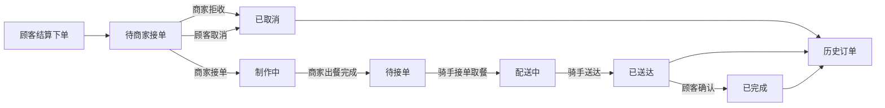

## Product Overview

将订单流程从“下单后商家默认接单”调整为“商家手动接单”。顾客下单后先进入“待商家接单”，商家可接单开始制作，也可拒收；顾客可在等待商家接单阶段取消订单。取消后的订单进入历史订单列表。

## Core Features

- 新增“待商家接单”订单状态，用于表达顾客已下单、商家尚未确认。
- 保留“待接单”状态，继续表示商家已出餐、等待骑手接单或取餐。
- 商家端订单列表增加待处理订单区，支持接单和拒收操作。
- 顾客端待处理订单展示“等待商家确认”的状态说明、AI 文案和进度条。
- 顾客取消或商家拒收后，订单状态变为“已取消”，并显示在历史订单中。
- 顾客端订单详情展示准确的状态解释和可用操作，避免混淆“商家接单”和“骑手接单”。

## Tech Stack

- 后端沿用 Scala 3、http4s、Circe、cats-effect、PostgreSQL。
- 前端沿用 Vite、React 19、TypeScript、Zustand、Tailwind CSS、shadcn/ui。
- API 继续遵循“一 API 一文件”规则：后端 `XxxAPIMessage.scala` 与前端 `XxxAPI.ts` 对应。
- 请求/响应对象按现有约定放入 `objects/*/apiTypes/`，通用成功响应可继续复用 `OkResponse`，新业务响应放入 merchant/order 对应 apiTypes。

## Existing Code Findings

- 订单状态定义位于：
- `backend/src/shared/objects/ids.scala`
- `frontend/src/objects/shared/ids.ts`
- 当前结算建单位于 `backend/src/order/api/OrderAPIMessageSupport.scala`，新订单目前直接进入 `OrderStatus.制作中`。
- 顾客取消已有：
- `backend/src/order/api/OrderCancelAPIMessage.scala`
- `frontend/src/apis/order/OrderCancelAPI.ts`
- 商家出餐已有：
- `backend/src/merchant/api/MerchantOrderReadyAPIMessage.scala`
- `frontend/src/apis/merchant/MerchantOrderReadyAPI.ts`
- 商家 API 注册位于 `backend/src/merchant/routes/MerchantRoutes.scala`。
- 商家订单 UI 和 store 位于：
- `frontend/src/pages/MerchantConsole/components/OrdersTab.tsx`
- `frontend/src/stores/pages/use-merchant-console-store.ts`
- 顾客订单 UI 和 store 位于：
- `frontend/src/pages/CustomerPortal/components/ProfileTab.tsx`
- `frontend/src/pages/CustomerPortal/components/OrderDetailDialog.tsx`
- `frontend/src/stores/pages/use-customer-portal-store.ts`
- AI 订单进度文案位于 `backend/src/ai/api/AIOrderProgressNarrativesAPIMessage.scala`。
- 骑手可抢订单仍由 `OrderStatus.待接单` 控制，新增状态不能暴露给骑手抢单列表。

## Architecture and Data Flow



### Key Rules

- `待商家接单`：顾客已付款，下单成功，等待商家确认；顾客端展示等待商家接单进度。
- `制作中`：商家已接单，后厨制作中；商家端可执行出餐完成。
- `待接单`：商家已出餐，等待骑手接单或取餐；骑手端只读取该状态作为可接订单。
- `已取消`：顾客取消或商家拒收后的终态，属于历史订单，并触发退款。
- `OrderStatus.history` 保持包含 `已送达`、`已完成`、`已取消`，确保取消订单进入历史列表。

## Module Division

### 1. Shared Status Contract

- 修改后端枚举 `OrderStatus`，新增 `待商家接单`。
- 修改前端 `OrderStatuses`，新增 `awaitingMerchantAcceptance: '待商家接单'`。
- 确保 Circe 枚举编解码和前端类型联合自动覆盖新状态。
- 避免新增硬编码中文状态字符串，所有判断使用枚举常量。

### 2. Checkout and Cancellation Lifecycle

- 将 `OrderAPIMessageSupport.buildOrdersForCheckout` 的初始订单状态从 `制作中` 改为 `待商家接单`。
- 调整 `OrderCancelAPIMessage`：顾客可取消待商家接单订单，状态变为 `已取消` 并退回实付金额。
- 取消后依赖 `CustomerOrdersAPIMessage` 的 history 过滤自动进入历史订单。
- 如需保持旧行为，可继续允许未分配骑手且未配送的订单取消，但 UI 应优先引导待商家接单阶段取消。

### 3. Merchant Decision APIs

新增商家决策 API，保持前后端文件一一对应：

- `MerchantOrderAcceptAPIMessage.scala` / `MerchantOrderAcceptAPI.ts`
- 校验商家拥有该订单所属店铺。
- 仅允许 `待商家接单` 状态执行。
- 将订单更新为 `制作中`。
- `MerchantOrderRejectAPIMessage.scala` / `MerchantOrderRejectAPI.ts`
- 校验商家拥有该订单所属店铺。
- 仅允许 `待商家接单` 状态执行。
- 将订单更新为 `已取消`，并退回顾客钱包。
- 需要在 `CustomerProfileTable` 增加按顾客 id 查询的方法，供商家拒收退款使用。
- 在 `MerchantRoutes.scala` 注册两个新 API。

### 4. Merchant Order UI

- `OrdersTab.tsx` 拆分订单区块：
- 待商家处理：展示 `待商家接单` 订单，提供“接单”“拒收”按钮。
- 出餐处理：展示 `制作中` 订单，提供“出餐完成”按钮。
- 已出餐/配送中：展示 `待接单`、`配送中` 等仍在履约中的订单。
- 历史订单：展示 `已取消`、`已送达`、`已完成`。
- `use-merchant-console-store.ts` 增加 `acceptOrder`、`rejectOrder` action，并在成功后刷新商家数据。
- 保持现有卡片、徽标、按钮风格，避免大规模重构页面结构。

### 5. Customer Order UI and AI Progress

- `ProfileTab.tsx` 为 `待商家接单` 显示专属状态说明，例如“订单已提交，正在等待商家确认”。
- 增加或调整订单进度值映射：
- `待商家接单`：低进度，表示等待确认。
- `制作中`：中前段进度。
- `待接单`：中后段进度，表示等待骑手。
- `配送中`：高进度。
- `已送达`：接近完成。
- `已取消`：历史终态，不展示为进行中进度。
- `OrderDetailDialog.tsx` 更新可取消状态和状态描述，避免将 `待接单` 误解为等待商家。
- 历史订单中保留已取消订单，并展示取消状态和 AI 取消文案。

### 6. AI Narrative Update

- `AIOrderProgressNarrativesAPIMessage.scala` 的 `progressStatuses` 增加 `待商家接单`。
- 为 `待商家接单` 增加 prompt 描述：等待商家确认，不能写成等待骑手。
- 继续保留 `待接单` 的约束：必须表达已出餐、等待骑手接单或取餐。
- fallback 文案增加 10 条“等待商家确认”短句，保证 OpenAI 不可用时顾客端仍可展示合理文案。

## Relevant Modified/New File Structure

```text
Type-safe_project/
├── backend/src/shared/objects/
│   └── ids.scala
├── backend/src/order/api/
│   ├── OrderAPIMessageSupport.scala
│   └── OrderCancelAPIMessage.scala
├── backend/src/merchant/api/
│   ├── MerchantAPIMessageSupport.scala
│   ├── MerchantOrderAcceptAPIMessage.scala
│   ├── MerchantOrderRejectAPIMessage.scala
│   └── MerchantOrderReadyAPIMessage.scala
├── backend/src/merchant/routes/
│   └── MerchantRoutes.scala
├── backend/src/merchant/objects/apiTypes/
│   ├── MerchantOrderAcceptResponse.scala
│   └── MerchantOrderRejectResponse.scala
├── backend/src/user/tables/customerprofile/
│   └── CustomerProfileTable.scala
├── backend/src/ai/api/
│   └── AIOrderProgressNarrativesAPIMessage.scala
├── frontend/src/objects/shared/
│   └── ids.ts
├── frontend/src/objects/merchant/apiTypes/
│   ├── MerchantOrderAcceptResponse.ts
│   └── MerchantOrderRejectResponse.ts
├── frontend/src/apis/merchant/
│   ├── MerchantOrderAcceptAPI.ts
│   └── MerchantOrderRejectAPI.ts
├── frontend/src/stores/pages/
│   ├── use-merchant-console-store.ts
│   └── use-customer-portal-store.ts
└── frontend/src/pages/
    ├── MerchantConsole/components/OrdersTab.tsx
    └── CustomerPortal/components/
        ├── ProfileTab.tsx
        └── OrderDetailDialog.tsx
```

## Key Code Structures

### OrderStatus Contract

```
enum OrderStatus derives CanEqual:
  case 待商家接单, 待接单, 制作中, 配送中, 已送达, 已完成, 已取消
```

```typescript
export const OrderStatuses = {
  awaitingMerchantAcceptance: '待商家接单',
  waitingForPickup: '待接单',
  cooking: '制作中',
  delivering: '配送中',
  delivered: '已送达',
  completed: '已完成',
  canceled: '已取消',
} as const
```

### Merchant Decision Response

```
final case class MerchantOrderAcceptResponse(order: Order)
final case class MerchantOrderRejectResponse(order: Order, refundedAmount: Double)
```

```typescript
export interface MerchantOrderAcceptResponse {
  order: Order
}

export interface MerchantOrderRejectResponse {
  order: Order
  refundedAmount: number
}
```

### Merchant Store Actions

```typescript
acceptOrder: (orderId: OrderId) => Promise<void>
rejectOrder: (orderId: OrderId) => Promise<void>
finishCooking: (orderId: OrderId) => Promise<void>
```

## Technical Implementation Plan

### Problem 1: Add a new order lifecycle state safely

- Solution: Add `待商家接单` to backend and frontend shared status definitions.
- Steps:

1. Update backend enum and frontend constants.
2. Replace direct string comparisons with `OrderStatus` / `OrderStatuses`.
3. Verify rider available orders still use only `待接单`.

- Testing:
- Backend compile verifies enum references.
- Frontend typecheck verifies status union usage.

### Problem 2: Change checkout default status

- Solution: New checkout orders start as `待商家接单`.
- Steps:

1. Modify `OrderAPIMessageSupport.scala`.
2. Confirm checkout response and customer order refresh show pending order.
3. Ensure wallet deduction remains unchanged until cancellation/refusal refund.

- Testing:
- Place order as customer; verify status is `待商家接单`.

### Problem 3: Add merchant accept/reject workflow

- Solution: Add two merchant APIs with ownership and status-transition validation.
- Steps:

1. Implement accept API: `待商家接单` to `制作中`.
2. Implement reject API: `待商家接单` to `已取消` with refund.
3. Register APIs and add frontend API wrappers.
4. Add store actions and refresh merchant data after mutations.

- Testing:
- Merchant can accept own order.
- Merchant cannot operate another store’s order.
- Reject refunds customer wallet and moves order to history.

### Problem 4: Correct customer AI progress and history display

- Solution: Add explicit UI mapping and AI narratives for new status.
- Steps:

1. Add status descriptions for `待商家接单` and preserve `待接单` rider meaning.
2. Add progress value mapping for visible active statuses.
3. Update AI prompt and fallback groups.
4. Ensure canceled orders appear in history.

- Testing:
- Customer sees waiting merchant confirmation text after checkout.
- Cancel/reject appears under history as `已取消`.
- AI fallback text does not confuse merchant and rider stages.

## Integration Points

- Frontend API calls still go through `frontend/src/apis/shared/sendAPI.ts` and registered backend API messages.
- Backend role enforcement remains `apiWithRole(..., "merchant")` for merchant decisions and existing customer role for cancellation.
- Data format remains JSON via Circe and TypeScript interfaces.
- Authentication remains existing JWT session flow; no new auth mechanism is required.

## Technical Considerations

### Logging

- Follow existing http4s error handling through `HttpApiError`.
- Keep validation errors user-readable: “订单已被处理”“当前状态不可接单”“当前状态不可拒收”。

### Performance

- Status filtering operates on already loaded order lists; no extra heavy query is required.
- Merchant reject needs one additional customer profile lookup by id; add indexed lookup using existing primary id field.

### Security

- Merchant accept/reject must call `MerchantAPIMessageSupport.requireOwnedStore`.
- Customer cancel must verify `order.customerId` equals current customer id.
- Reject/cancel must be idempotency-safe by rejecting already canceled or non-waiting orders to prevent duplicate refunds.

### Scalability

- The lifecycle remains enum-driven and can later support additional states such as refund review or merchant timeout.
- API-per-action keeps the current codebase convention and avoids introducing unrelated orchestration patterns.

## Agent Extensions

### SubAgent

- **code-explorer**
- Purpose: 在实现前快速确认所有订单状态、API、页面和 store 的影响范围。
- Expected outcome: 形成准确的修改文件清单，避免遗漏骑手抢单、顾客历史订单和 AI 文案相关逻辑。

### Skill

- **type-safety-audit**
- Purpose: 在实现后审计前后端 API 文件对应、objects/apiTypes 分层、枚举状态契约和页面拆分规范。
- Expected outcome: 确认新增状态与商家决策 API 前后端类型一致，且没有硬编码状态或绕过 APIMessage 的问题。