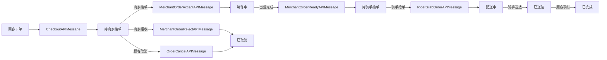
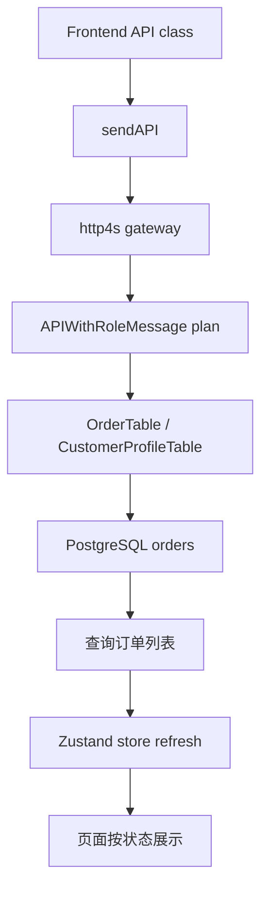

## Product Overview

外卖订单流程改为商家手动接单模式：顾客下单后先进入“待商家接单”，商家确认后才进入制作；商家可拒收，顾客可取消，取消订单进入历史订单。

## Core Features

- 新增订单状态“待商家接单”，顾客下单后默认进入该状态，商家端展示为待处理订单。
- 商家端订单页新增“接单”和“拒收”操作；接单后订单进入“制作中”，拒收后进入“已取消”。
- 将旧的“待接单”语义统一改名为“待骑手接单”，表示商家已出餐、等待骑手接单/取餐。
- 更新完整状态流转：待商家接单 → 制作中 → 待骑手接单 → 配送中 → 已送达 → 已完成；顾客取消或商家拒收 → 已取消。
- 顾客端在待商家接单时显示明确的等待商家确认状态、可取消入口，以及更合适的 AI 进度文案。
- 骑手端只展示“待骑手接单”的可抢订单，避免看到尚未被商家确认的订单。
- 历史订单包含已取消订单，顾客、商家、骑手各端订单列表语义保持一致。

## Tech Stack

- 后端：Scala 3、cats-effect IO、http4s、Circe、JDBC、PostgreSQL。
- 前端：React 19、Vite、TypeScript、Zustand、shadcn/Radix UI、Tailwind CSS。
- 项目约定：继续遵守“一 API 一文件”，后端 `XxxAPIMessage.scala` 与前端 `XxxAPI.ts` 对应；领域对象在 `objects/*`，请求/响应包装对象在 `objects/*/apiTypes`。

## Architecture

本次是既有订单状态机扩展，应复用当前单进程后端、APIMessage 网关、前端 Zustand store 与页面拆分方式，不引入新的架构范式。

### System Flow



### Module Division

- **共享状态契约模块**：维护前后端 `OrderStatus` 枚举、旧值兼容解析、历史订单集合。
- **订单生命周期模块**：调整建单默认状态、取消规则、历史/待处理列表划分。
- **商家操作模块**：新增接单/拒收 API，更新出餐完成流转与商家订单面板。
- **骑手派单模块**：将可抢单来源从旧“待接单”改为“待骑手接单”。
- **AI 进度文案模块**：为“待商家接单”和“待骑手接单”生成不同文案。
- **前端展示模块**：同步顾客、商家、骑手端订单状态标签、说明与按钮。

### Data Flow



## Implementation Details

### Relevant Files To Modify / Add

```
Type-safe_project/
├── backend/src/shared/objects/ids.scala
├── backend/src/shared/json/ApiJsonCodecs.scala
├── backend/src/order/api/OrderAPIMessageSupport.scala
├── backend/src/order/api/OrderCancelAPIMessage.scala
├── backend/src/order/tables/order/OrderTable.scala
├── backend/src/order/tables/order/OrderTableInitializer.scala
├── backend/src/merchant/api/MerchantAPIMessageSupport.scala
├── backend/src/merchant/api/MerchantOrderAcceptAPIMessage.scala       # new
├── backend/src/merchant/api/MerchantOrderRejectAPIMessage.scala       # new
├── backend/src/merchant/api/MerchantOrderReadyAPIMessage.scala
├── backend/src/merchant/routes/MerchantRoutes.scala
├── backend/src/rider/api/RiderAPIMessageSupport.scala
├── backend/src/rider/api/RiderGrabOrderAPIMessage.scala
├── backend/src/ai/api/AIOrderProgressNarrativesAPIMessage.scala
├── frontend/src/objects/shared/ids.ts
├── frontend/src/apis/merchant/MerchantOrderAcceptAPI.ts               # new
├── frontend/src/apis/merchant/MerchantOrderRejectAPI.ts               # new
├── frontend/src/apis/merchant/MerchantOrderReadyAPI.ts
├── frontend/src/pages/MerchantConsole/components/OrdersTab.tsx
├── frontend/src/pages/MerchantConsole/index.tsx
├── frontend/src/stores/pages/use-merchant-console-store.ts
├── frontend/src/pages/CustomerPortal/components/ProfileTab.tsx
├── frontend/src/pages/CustomerPortal/components/OrderDetailDialog.tsx
├── frontend/src/stores/pages/use-customer-portal-store.ts
└── frontend/src/pages/RiderApp/components/DispatchCard.tsx
```

### Key Code Structures

后端状态枚举应明确表达新状态，并兼容数据库或旧 JSON 中遗留的“待接单”。

```
enum OrderStatus derives CanEqual:
  case 待商家接单, 制作中, 待骑手接单, 配送中, 已送达, 已完成, 已取消

object OrderStatus:
  def fromString(value: String): Option[OrderStatus] =
    value match
      case "待接单" => Some(待骑手接单)
      case _        => values.find(_.toString == value)

  val history: Set[OrderStatus] = Set(已送达, 已完成, 已取消)
```

前端状态键应避免继续使用旧 `waitingForPickup: '待接单'` 文案。

```typescript
export const OrderStatuses = {
  waitingForMerchantAcceptance: '待商家接单',
  cooking: '制作中',
  waitingForRiderAcceptance: '待骑手接单',
  delivering: '配送中',
  delivered: '已送达',
  completed: '已完成',
  canceled: '已取消',
} as const
```

新增商家 API 保持当前 APIMessage 风格。

```
final case class MerchantOrderAcceptAPIMessage(orderId: OrderId) extends APIWithRoleMessage[OkResponse]
final case class MerchantOrderRejectAPIMessage(orderId: OrderId) extends APIWithRoleMessage[OkResponse]
```

### Technical Implementation Plan

1. **状态契约更新**

- 新增“待商家接单”和“待骑手接单”。
- 更新前端状态常量和所有旧 `waitingForPickup` 引用。
- 在后端解析层兼容旧字符串“待接单”。
- 调整数据库 CHECK 约束与旧数据迁移，避免既有订单无法读取或写入。

2. **订单建单与取消**

- `OrderAPIMessageSupport.buildOrdersForCheckout` 将新订单设为“待商家接单”。
- `OrderCancelAPIMessage` 确保“待商家接单”可由顾客取消并退款。
- `OrderStatus.history` 保持“已取消”为历史状态，订单列表自动归档。

3. **商家手动接单/拒收**

- 新增 `MerchantOrderAcceptAPIMessage`：校验店铺归属和当前状态，仅允许“待商家接单”进入“制作中”。
- 新增 `MerchantOrderRejectAPIMessage`：校验店铺归属和当前状态，将订单置为“已取消”，并为顾客退回实付金额。
- 注册到 `MerchantRoutes.apiMessages`。
- `MerchantOrderReadyAPIMessage` 出餐完成后改为“待骑手接单”。

4. **骑手派单**

- `RiderAPIMessageSupport.isAvailableOrder` 改为只允许“待骑手接单”。
- `OrderTable.listAvailableUnassigned` 查询新状态。
- 骑手抢单 API 保持进入“配送中”，但错误提示语义改为“待骑手接单订单”。

5. **AI 与前端展示**

- `AIOrderProgressNarrativesAPIMessage` 同时生成“待商家接单”和“待骑手接单”文案，删除旧“待接单”描述。
- 商家端订单页拆分待接单、制作中、历史订单区块，新增接单/拒收按钮。
- 顾客端订单卡片和详情弹窗增加待商家确认说明、AI 文案和取消入口。
- 骑手端抢单说明统一为“待骑手接单”。

### Integration Points

- 前端新 API：`MerchantOrderAcceptAPI.ts`、`MerchantOrderRejectAPI.ts` 通过 `sendAPI` 调用网关。
- 后端新 API：注册为商家角色 API，复用 `APIWithRoleMessage[OkResponse]`。
- 数据格式：继续使用 JSON；订单状态以中文枚举字符串在前后端传递。
- 权限：商家 API 必须使用 `requireOwnedStore` 校验店铺归属；顾客取消继续校验订单归属。

### Technical Considerations

- **数据兼容**：旧“待接单”数据应迁移为“待骑手接单”，并在解析层临时兼容。
- **一致性**：商家拒收退款需与订单取消退款口径一致，避免重复退款。
- **安全**：所有状态变更必须校验当前状态和角色归属，禁止越权推进订单。
- **性能**：继续使用 `orders_status_idx` 与 `orders_available_idx` 支撑状态列表查询。
- **验证**：后端运行 `sbt compile`，前端运行 `npm run typecheck` 与 `npm run lint`，并手动验证下单、商家接单/拒收、顾客取消、骑手抢单全链路。

## Design Approach

沿用当前餐饮配送后台的温暖橙色系与卡片式布局，重点增强订单状态辨识度和操作明确性。

## Page Planning

- **商家订单页**：顶部保留店铺上下文；新增“待商家接单”高优先级卡片区，订单卡展示金额、商品数量、下单时间，并提供“接单”“拒收”按钮；制作中区保留“出餐完成”；历史区展示已取消、配送中、已完成等订单。
- **顾客订单区**：待商家接单订单使用更柔和的等待态进度条，配合 AI 短文案说明“商家正在确认”；详情弹窗显示当前状态、可取消按钮和退款预期说明。
- **骑手抢单区**：文案统一为“待骑手接单”，只展示商家已出餐的订单，避免误解为商家未确认订单。
- **交互反馈**：接单、拒收、取消后刷新列表并显示结果提示；按钮采用明确的主次样式，拒收使用危险色但不过度强调。

## Agent Extensions

### SubAgent

- **code-explorer**
- Purpose: 跨前后端扫描订单状态、API 文件、页面展示和 store 调用引用。
- Expected outcome: 找出所有旧“待接单”与 `waitingForPickup` 引用，避免遗漏状态迁移点。

### Skill

- **type-safety-audit**
- Purpose: 审计 Type-safe_project 前后端 API 文件对应、objects/apiTypes 分层、状态枚举一致性和页面结构。
- Expected outcome: 确认新增商家 API、订单状态和前端类型契约符合项目规则。