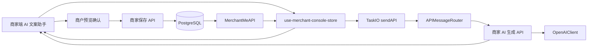
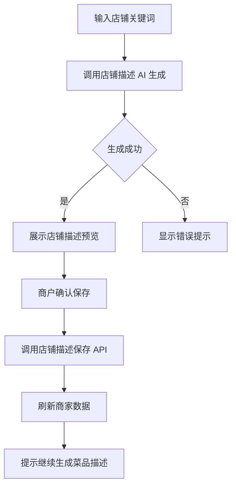
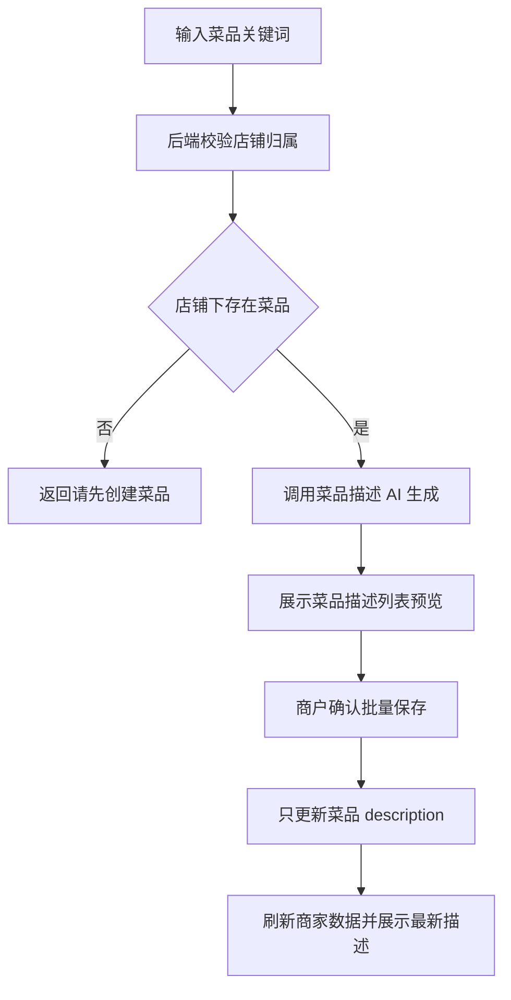

## Product Overview

商家端新增独立的 AI 文案流程，帮助商户分别生成店铺描述与菜品描述。商户输入关键词后先生成文案预览，确认后才保存；店铺描述保存完成后，页面提示商户继续生成菜品描述。

## Core Features

- 店铺描述 AI 生成：商户选择店铺并输入关键词，生成适合店铺定位的描述文案。
- 店铺描述确认保存：生成结果先展示预览，商户确认后写入店铺信息。
- 菜品描述 AI 生成：商户选择已有菜品的店铺，输入关键词后为店铺下菜品生成描述，不检查库存、上下架或剩余库存。
- 菜品描述确认保存：菜品描述生成后以列表形式预览，商户确认后批量保存到对应菜品。
- 流程引导提示：店铺描述保存成功后，显示继续生成菜品描述的引导按钮或提示卡片。
- 空状态提示：未选择店铺、店铺无菜品、关键词为空、生成失败等状态均有明确提示。
- 视觉效果：在商家端菜品页加入轻量 AI 文案助手卡片，采用橙色系高亮、预览弹窗、进度按钮与成功提示，保持现有商家端风格一致。

## Tech Stack

- 前端：React 19、TypeScript、Vite 8、Zustand、Tailwind CSS、Radix/shadcn 风格组件。
- 后端：Scala 3.3.3、http4s、Cats Effect、Circe、PostgreSQL、JDBC 表访问层。
- API 形态：前端通过 `APIMessage`、`TaskIO`、`sendAPI` 请求网关；后端通过 `RegisteredAPIMessage` 注册 `/api/{apiName}`。
- 当前相关入口：
- `frontend/src/pages/MerchantConsole/index.tsx`
- `frontend/src/pages/MerchantConsole/ProductsTab.tsx`
- `frontend/src/stores/pages/use-merchant-console-store.ts`
- `backend/src/ai/api/AIAPIMessages.scala`
- `backend/src/ai/routes/AIRoutes.scala`
- `backend/src/merchant/api/MerchantAPIMessages.scala`
- `backend/src/merchant/tables/merchantstore/MerchantStoreTable.scala`
- `backend/src/merchant/tables/catalogproduct/CatalogProductTable.scala`

## Architecture

### System Architecture

本次改动沿用现有网关和 APIMessage 架构，不引入新服务。AI 生成只返回候选文案，保存动作走商家持久化 API，保证商户确认后才落库。



### Module Division

- **AI 生成模块**
- 后端新增商家角色 AI API，负责店铺描述和菜品描述候选生成。
- 依赖 `OpenAIClient`、当前商家店铺和菜品数据。
- 只返回候选内容，不写数据库。

- **商家描述持久化模块**
- `Merchant` 新增 `description` 字段。
- `merchant_stores` 与 `catalog_merchants` 增加 `description` 列。
- 新增店铺描述保存 API，确认后写入后端。

- **菜品描述批量保存模块**
- 新增批量保存菜品描述 API。
- 后端按当前商户拥有的店铺校验菜品归属，只更新 `description`，保留价格、库存、上下架等字段。

- **商家端交互模块**
- 在 `ProductsTab.tsx` 增加 AI 文案助手卡片和预览弹窗。
- `use-merchant-console-store.ts` 增加生成、保存、刷新动作。
- 生成结果只作为临时预览状态，真实数据以保存后 `refreshMerchant()` 为准。

## Data Flow

### 店铺描述流程



### 菜品描述流程



## Core Directory Structure

```text
Type-safe_project/
├── backend/src/ai/
│   ├── api/
│   │   ├── AIMerchantStoreDescriptionApi.scala        # 新增店铺描述 AI 生成
│   │   └── AIMerchantProductDescriptionsApi.scala     # 新增菜品描述 AI 生成
│   ├── objects/
│   │   ├── AIMerchantStoreDescriptionRequest.scala
│   │   ├── AIMerchantStoreDescriptionResponse.scala
│   │   ├── AIMerchantProductDescriptionsRequest.scala
│   │   ├── AIMerchantProductDescriptionsResponse.scala
│   │   └── AIGeneratedProductDescription.scala
│   └── routes/AIRoutes.scala                          # 注册 merchant 角色 AI API
├── backend/src/merchant/
│   ├── api/
│   │   ├── MerchantStoreDescriptionApi.scala          # 新增店铺描述保存
│   │   └── MerchantProductDescriptionsApi.scala       # 新增菜品描述批量保存
│   ├── objects/
│   │   ├── Merchant.scala                             # 新增 description
│   │   └── ProductDescriptionPatch.scala              # 新增批量保存入参对象
│   └── tables/merchantstore/
│       ├── MerchantStoreTable.scala                   # 读写 description
│       └── MerchantStoreTableInitializer.scala        # 增加 description 列
└── frontend/src/
    ├── api/
    │   ├── ai/
    │   │   ├── AIMerchantStoreDescriptionApi.ts
    │   │   └── AIMerchantProductDescriptionsApi.ts
    │   └── merchant/
    │       ├── MerchantStoreDescriptionApi.ts
    │       └── MerchantProductDescriptionsApi.ts
    ├── objects/
    │   ├── ai/                                       # 新增 AI 请求响应对象
    │   └── merchant/
    │       ├── Merchant.ts                            # 新增 description
    │       └── ProductDescriptionPatch.ts
    ├── pages/MerchantConsole/
    │   ├── ProductsTab.tsx                            # 新增 AI 文案助手 UI
    │   └── MerchantAICopywritingCard.tsx              # 可拆分的新组件
    └── stores/pages/use-merchant-console-store.ts     # 新增 AI 动作
```

## Key Code Structures

### Merchant contract

```
final case class Merchant(
    id: MerchantId,
    storeName: String,
    category: MerchantCategory,
    address: String,
    phone: String,
    rating: Double,
    tags: List[String],
    featuredProductIds: List[ProductId],
    imageUrl: Option[String],
    description: String
)
```

```typescript
export interface Merchant {
  id: MerchantId
  storeName: string
  category: MerchantCategory
  address: string
  phone: string
  rating: number
  tags: string[]
  featuredProductIds: ProductId[]
  imageUrl?: string | null
  description: string
}
```

### AI generation interfaces

```typescript
export interface AIMerchantStoreDescriptionRequest {
  merchantId: MerchantId
  keywords: string
}

export interface AIMerchantStoreDescriptionResponse {
  merchantId: MerchantId
  description: string
  generatedAt: string
}
```

```typescript
export interface AIGeneratedProductDescription {
  productId: ProductId
  productName: string
  description: string
}

export interface AIMerchantProductDescriptionsResponse {
  merchantId: MerchantId
  products: AIGeneratedProductDescription[]
  generatedAt: string
}
```

### Save interfaces

```typescript
export interface ProductDescriptionPatch {
  productId: ProductId
  description: string
}
```

```
final case class MerchantStoreDescriptionAPIMessage(
    merchantId: MerchantId,
    description: String
) extends APIWithRoleMessage[OkResponse]
```

```
final case class MerchantProductDescriptionsAPIMessage(
    merchantId: MerchantId,
    descriptions: List[ProductDescriptionPatch]
) extends APIWithRoleMessage[OkResponse]
```

## Technical Implementation Plan

### 1. 店铺描述持久化

- Problem：当前 `Merchant` 无 `description` 字段，AI 店铺描述无法后端持久化。
- Solution：扩展 Merchant 契约、数据库表、种子数据和注册默认店铺。
- Key technologies：Scala case class、PostgreSQL DDL、Circe 自动编解码、TypeScript interface。
- Steps：

1. `merchant_stores` 和 `catalog_merchants` 增加 `description TEXT NOT NULL DEFAULT ''`。
2. 更新 `MerchantStoreTable` 的 insert、select、bind、read。
3. 更新 `SeedData.scala`、`UserAPIMessages.scala`、前端 `Merchant.ts`。
4. 确保顾客端和商家端读取旧数据时有空字符串默认值。

- Testing：运行后端编译，登录商家端确认店铺数据可加载。

### 2. 店铺描述生成与保存拆分

- Problem：生成结果必须先预览，确认后才写入。
- Solution：AI API 只生成候选文案；Merchant API 负责保存。
- Key technologies：`OpenAIClient`、`APIWithRoleMessage`、`OkResponse`。
- Steps：

1. 新增 `AIMerchantStoreDescriptionAPIMessage`，校验商家拥有店铺、关键词非空。
2. 生成 prompt，返回 `AIMerchantStoreDescriptionResponse`。
3. 新增 `MerchantStoreDescriptionAPIMessage` 保存确认文案。
4. 保存后调用 `refreshMerchant()` 获取后端最新状态。

- Testing：未配置 AI、关键词为空、无权限店铺均返回明确错误。

### 3. 菜品描述生成与批量保存

- Problem：菜品描述生成只需店铺下存在菜品，不应检查库存、上下架、剩余库存。
- Solution：后端仅按 `merchantId` 过滤当前店铺产品，生成和保存时校验归属。
- Key technologies：CatalogProductTable、AI JSON 解析、批量描述 patch。
- Steps：

1. 新增 `AIMerchantProductDescriptionsAPIMessage`。
2. 校验当前店铺产品列表非空，不读取库存状态作为生成前置条件。
3. 解析 AI 返回的 productId 和 description，只接受当前店铺产品 ID。
4. 新增 `MerchantProductDescriptionsAPIMessage` 批量保存描述。

- Testing：店铺无菜品时返回“请先创建菜品”；下架或零库存菜品仍可生成描述。

### 4. 前端商家端交互

- Problem：需要形成“店铺描述保存后继续菜品描述”的清晰流程。
- Solution：在 `ProductsTab` 增加 AI 文案助手卡片，使用弹窗承载预览和确认。
- Key technologies：React state、Zustand action、shadcn Dialog、Textarea、Button。
- Steps：

1. 增加关键词输入、店铺描述生成按钮和店铺描述预览弹窗。
2. 店铺保存成功后展示继续生成菜品描述的提示和 CTA。
3. 增加菜品描述生成按钮、列表预览和批量保存确认。
4. 所有保存动作结束后刷新商家数据。

- Testing：手动验证店铺描述和菜品描述均需确认后才更新页面。

## Integration Points

- AI API：注册到 `AIRoutes.scala`，角色为 `merchant`。
- Merchant API：注册到 `MerchantRoutes.scala`，角色为 `merchant`。
- 前端 API：新增文件与后端 API 名称保持一致，`apiName` 使用后端注册规则的小写名称。
- 数据格式：JSON 请求响应，沿用 Circe 与 TypeScript interface。
- 鉴权：沿用 JWT Bearer 和 `APIWithRoleMessage`，只允许 merchant 角色调用。

## Technical Considerations

- Logging：沿用现有 http4s 和 log4cats/slf4j 输出，不新增独立日志体系。
- Performance：AI 生成按钮增加 loading 与防重复提交；批量保存一次提交，避免逐个菜品多次请求。
- Security：后端校验关键词和描述长度；保存时重新校验店铺归属和菜品归属，不能信任前端传入 ID。
- Type Safety：所有新增请求、响应、对象在前后端同名补齐，避免硬编码枚举或任意字符串替代 ID 类型别名。
- Scala Constraint：新增 Scala 代码仅使用 `val`，不新增 `var`。

## Design Approach

在商家端“菜品”页新增一张“AI 文案助手”卡片，位于店铺概览与商品管理之间。整体延续当前橙色外卖风格，使用圆角白色卡片、浅橙背景、细边框和主按钮强调 AI 操作。

## Page Blocks

1. 顶部状态区：展示当前店铺名、店铺描述摘要、菜品数量，帮助商户确认操作对象。
2. 店铺描述生成区：关键词输入框、生成按钮、当前描述展示，生成时按钮显示加载状态。
3. 店铺描述预览弹窗：展示 AI 生成内容，允许商户确认保存或取消返回。
4. 流程引导提示：店铺描述保存后出现浅橙提示条，引导“继续生成菜品描述”。
5. 菜品描述生成区：仅在店铺存在菜品时启用；无菜品时显示创建菜品提示。
6. 菜品描述预览弹窗：按菜品列表展示生成描述，确认后批量保存，成功后刷新列表。

## Interaction

按钮使用轻微 hover 阴影和橙色渐变强调；预览弹窗聚焦确认动作；错误提示保持红色轻量警示；成功后使用现有 notice 机制反馈。

## Agent Extensions

### Skill

- **type-safety-audit**
- Purpose: 审计本次新增 AI 文案流程的前后端 API、objects、ID 类型、持久化和商家端状态一致性。
- Expected outcome: 确认新增店铺描述、AI 请求响应、菜品描述保存等契约前后端一一对应，且业务数据不以前端本地状态作为真实来源。