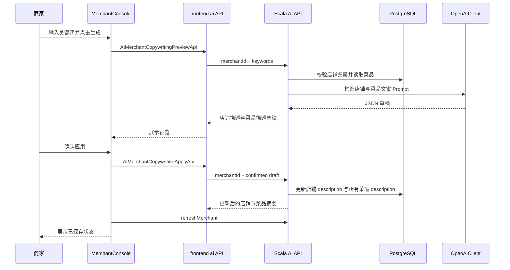

## Product Overview

为商家端新增 AI 店铺描述与菜品文案优化流程。商家完成店铺与菜品创建后，可输入经营特色、口味风格、目标客群等关键词，由 AI 生成店铺描述和菜品描述草稿；商家预览确认后，系统将店铺描述与所有菜品描述写入后端并作为真实业务数据展示。

## Core Features

- 商家在菜品管理页进入 AI 文案优化入口，输入关键词生成文案。
- AI 根据当前店铺信息、菜品列表和关键词生成店铺描述与菜品描述草稿。
- 商家可在确认弹窗中预览生成结果，查看店铺描述和每个菜品的新描述。
- 商家确认后批量持久化：店铺 description 写入店铺数据，菜品 description 批量更新现有菜品。
- 顾客端商家列表与商家详情展示店铺描述，菜品列表继续展示优化后的菜品描述。
- 流程包含加载、失败提示、重试、无菜品提示，避免未确认内容被当作真实业务数据。

## Tech Stack

- 复用现有前端：React 19、Vite 8、TypeScript、Tailwind CSS、shadcn/Radix UI、Zustand。
- 复用现有后端：Scala 3.3、http4s、Cats Effect、Circe、PostgreSQL、APIMessage/TaskIO 调用模型。
- 复用现有 AI 能力：`backend/src/ai/utils/OpenAIClient.scala` 与 `/api` 网关注册机制。
- 遵守项目约束：前端只通过 HTTP API 调用后端；业务数据以后端持久化为准；Scala 后端不新增 `var`；新增 API/对象保持前后端文件与职责对应。

## Existing Code Findings

- 商家端入口：`frontend/src/pages/MerchantConsole/index.tsx`，菜品页：`ProductsTab.tsx`，店铺选择：`StoreSelectorDialog.tsx`。
- 商家端状态：`frontend/src/stores/pages/use-merchant-console-store.ts`，已有 `createProduct`、`updateProduct`、`refreshMerchant` 流程。
- AI 后端：`backend/src/ai/api/AIAPIMessages.scala`、`backend/src/ai/routes/AIRoutes.scala`，已有 `AISearchAPIMessage`、订单进度文案、饮食周报模式。
- 商家/菜品对象：`Merchant` 目前无 `description` 字段；`Product` 已有 `description`。
- 店铺表：`MerchantStoreTable.scala` 同步写入 `merchant_stores` 与 `catalog_merchants`；需要新增 description 列并同步读写。
- 顾客端展示：`HomeTab.tsx` 商家卡片、`CustomerMerchantOrderPage.tsx` 商家详情和菜品卡片。

## System Architecture

```mermaid
flowchart LR
  A[商家端 ProductsTab] --> B[Zustand MerchantConsole Store]
  B --> C[frontend/src/api/ai]
  C --> D[/api 网关 APIMessageRouter]
  D --> E[AIRoutes merchant role API]
  E --> F[MerchantStoreTable]
  E --> G[CatalogProductTable]
  E --> H[OpenAIClient]
  H --> E
  E --> C
  C --> B
  B --> A
  E --> I[(PostgreSQL merchant/catalog tables)]
  I --> J[CatalogAPIMessage]
  J --> K[顾客端商家列表/详情]
```

## Module Division

- **契约对象模块**
- 后端：`backend/src/ai/objects/`、`backend/src/merchant/objects/Merchant.scala`
- 前端：`frontend/src/objects/ai/`、`frontend/src/objects/merchant/Merchant.ts`
- 职责：定义 AI 文案请求、草稿、确认请求、确认响应，以及店铺 description 字段。

- **持久化模块**
- 后端：`MerchantStoreTable.scala`、`MerchantStoreTableInitializer.scala`、`CatalogProductTable.scala`
- 职责：为店铺 description 新增数据库列，读写 `merchant_stores` 与 `catalog_merchants`，批量更新菜品 description。

- **AI 文案 API 模块**
- 后端新增：`AIMerchantCopywritingPreviewApi.scala`、`AIMerchantCopywritingApplyApi.scala`
- 前端新增同名 API 文件：`AIMerchantCopywritingPreviewApi.ts`、`AIMerchantCopywritingApplyApi.ts`
- 职责：预览生成不落库；确认后写入店铺与菜品。

- **商家端 UI 与状态模块**
- 前端：`ProductsTab.tsx`、可新增 `AICopywritingDialog.tsx`、`use-merchant-console-store.ts`
- 职责：关键词输入、预览弹窗、确认持久化、刷新商家数据。

- **顾客端展示模块**
- 前端：`HomeTab.tsx`、`CustomerMerchantOrderPage.tsx`
- 职责：展示持久化后的店铺描述和优化后的菜品描述。

## Data Flow



## Core Directory Structure

```text
Type-safe_project/
├── backend/src/ai/api/
│   ├── AIMerchantCopywritingPreviewApi.scala   # 新增：生成 AI 文案草稿
│   └── AIMerchantCopywritingApplyApi.scala     # 新增：确认并持久化文案
├── backend/src/ai/objects/
│   ├── AIMerchantCopywritingPreviewRequest.scala
│   ├── AIMerchantCopywritingApplyRequest.scala
│   ├── AIMerchantCopywritingDraft.scala
│   ├── AIMerchantCopywritingProductDraft.scala
│   └── AIMerchantCopywritingApplyResponse.scala
├── backend/src/ai/routes/AIRoutes.scala        # 修改：注册 merchant 角色 AI API
├── backend/src/shared/json/ApiJsonCodecs.scala # 修改：新增 AI 文案对象 codec
├── backend/src/merchant/objects/Merchant.scala # 修改：新增 description 字段
├── backend/src/merchant/tables/merchantstore/
│   ├── MerchantStoreTable.scala                # 修改：读写 description
│   └── MerchantStoreTableInitializer.scala     # 修改：新增/迁移 description 列
├── frontend/src/api/ai/
│   ├── AIMerchantCopywritingPreviewApi.ts
│   └── AIMerchantCopywritingApplyApi.ts
├── frontend/src/objects/ai/
│   ├── AIMerchantCopywritingPreviewRequest.ts
│   ├── AIMerchantCopywritingApplyRequest.ts
│   ├── AIMerchantCopywritingDraft.ts
│   ├── AIMerchantCopywritingProductDraft.ts
│   └── AIMerchantCopywritingApplyResponse.ts
├── frontend/src/objects/merchant/Merchant.ts   # 修改：新增 description 字段
├── frontend/src/stores/pages/use-merchant-console-store.ts
├── frontend/src/pages/MerchantConsole/
│   ├── ProductsTab.tsx
│   └── AICopywritingDialog.tsx                 # 新增：AI 文案预览确认弹窗
└── frontend/src/pages/CustomerPortal/
    ├── HomeTab.tsx
    └── CustomerMerchantOrderPage.tsx
```

## Key Code Structures

```
final case class AIMerchantCopywritingPreviewRequest(
    merchantId: MerchantId,
    keywords: String
)

final case class AIMerchantCopywritingProductDraft(
    productId: ProductId,
    productName: String,
    description: String
)

final case class AIMerchantCopywritingDraft(
    merchantId: MerchantId,
    storeDescription: String,
    products: List[AIMerchantCopywritingProductDraft],
    generatedAt: String
)

final case class AIMerchantCopywritingApplyRequest(
    merchantId: MerchantId,
    storeDescription: String,
    products: List[AIMerchantCopywritingProductDraft]
)

final case class AIMerchantCopywritingApplyResponse(
    merchant: Merchant,
    products: List[Product]
)
```

```typescript
export interface AIMerchantCopywritingDraft {
  merchantId: MerchantId
  storeDescription: string
  products: AIMerchantCopywritingProductDraft[]
  generatedAt: string
}

export function previewMerchantCopywritingIO(
  request: AIMerchantCopywritingPreviewRequest,
): TaskIO<AIMerchantCopywritingDraft>

export function applyMerchantCopywritingIO(
  request: AIMerchantCopywritingApplyRequest,
): TaskIO<AIMerchantCopywritingApplyResponse>
```

## Technical Implementation Plan

### 1. 店铺 description 契约与持久化

- 在 `Merchant` 前后端对象中新增 `description: String` / `description: string`。
- `MerchantStoreTableInitializer.scala` 中为 `merchant_stores` 与 `catalog_merchants` 加 `description TEXT NOT NULL DEFAULT ''`，并使用 `ALTER TABLE ... ADD COLUMN IF NOT EXISTS` 兼容已有库。
- `MerchantStoreTable.scala` 的 insert/update/select/bind/read 全链路同步 description。
- 新建店铺默认 description 为空字符串，AI 确认后再写入真实文案。

### 2. AI 文案预览 API

- 新增 merchant 角色 API，输入 `merchantId` 与 `keywords`。
- 服务端校验关键词非空、长度限制、店铺归属、菜品数量大于 0。
- Prompt 使用店铺名称、类目、地址、已有店铺描述、菜品名称和已有描述，要求返回严格 JSON。
- 解析结果时校验 productId 必须属于该店；缺失菜品使用安全兜底文案或保留原描述，确保覆盖当前店铺所有菜品。

### 3. AI 文案确认 API

- 输入 `merchantId`、确认后的 `storeDescription`、菜品文案列表。
- 服务端再次校验店铺归属、描述长度、productId 全部属于当前店铺。
- 更新店铺 description，并通过 `CatalogProductTable.upsert` 更新所有目标菜品 description。
- 返回更新后的 `merchant` 与 `products`，前端随后调用 `refreshMerchant` 与后端数据对齐。

### 4. 商家端交互接入

- 在 `ProductsTab.tsx` 增加 AI 文案优化卡片，仅在已选择店铺且有菜品时允许生成。
- 新增 `AICopywritingDialog.tsx` 承载关键词输入、加载状态、草稿预览、确认应用、错误重试。
- 在 Zustand store 中新增 `previewMerchantCopywriting` 与 `applyMerchantCopywriting`，仅保存短期 UI 草稿，不作为真实业务数据。
- 确认后刷新商家数据，并显示成功提示。

### 5. 顾客端展示

- `HomeTab.tsx` 商家卡片在地址下方展示 `merchant.description`，为空时不占位。
- `CustomerMerchantOrderPage.tsx` 店铺头部展示店铺描述，菜品卡片自然显示批量更新后的描述。
- 保持现有图片、标签、评分和点餐流程不变。

## Integration Points

- 后端 API 注册：`AIRoutes.apiMessages` 增加两个 `apiWithRole[..., ...]("merchant")`。
- 前端调用：新增 `frontend/src/api/ai/*`，通过现有 `sendAPI` 和 `TaskIO` 接入。
- 数据格式：前后端 JSON 字段保持 camelCase，与现有 Circe/TypeScript 对象一致。
- 鉴权：复用 JWT 与 `APIWithRoleMessage`，仅 merchant 角色可生成和应用商家文案。
- 外部服务：复用 `OpenAIClient.chatCompletion`，AI 未配置时返回清晰错误，不写入数据库。

## Technical Considerations

- **类型安全**：新增 API 文件与对象文件前后端一一对应；避免硬编码枚举；`MerchantId`、`ProductId` 使用既有类型别名。
- **安全**：所有写入都在后端校验店铺归属；限制关键词和文案长度；不允许前端传入越权 productId。
- **可靠性**：预览失败不落库；确认失败不更新 UI 为成功；确认后强制 `refreshMerchant`。
- **性能**：一次店铺级 AI 调用覆盖所有菜品；对菜品数量设置合理上限，避免 Prompt 过长；前端展示骨架屏和禁用重复提交。
- **兼容性**：数据库初始化同时支持新库建表和旧库补列；空 description 兼容已有种子数据。
- **验证**：运行 `npm run typecheck --prefix frontend`、`npm run build --prefix frontend`、`cd backend && sbt compile`，并进行商家生成、确认、顾客展示端到端验证。

## Design Approach

在现有商家控制台的橙色餐饮视觉基础上，新增一个更有“AI 助手感”的文案优化流程，使用发光渐变、玻璃质感卡片和轻量动效突出智能生成能力，同时不破坏当前后台操作效率。

## Page Planning

### 商家端菜品管理页

- **顶部店铺概览区**：保留店铺名称和商品数卡片，新增店铺描述摘要，空状态显示“尚未生成店铺描述”。
- **AI 文案优化卡片**：位于商品管理上方，使用 Sparkles 图标、橙紫渐变背景、关键词输入和“生成文案”按钮。
- **草稿预览弹窗**：左侧显示店铺描述，右侧按菜品列表展示 AI 描述，支持滚动查看所有菜品。
- **确认操作区**：底部固定“重新生成 / 确认应用”按钮，确认时显示进度与不可重复提交状态。
- **结果反馈**：应用成功后显示顶部通知，并刷新列表中店铺描述和菜品描述。

### 顾客端商家列表与详情

- **商家卡片描述**：在地址下方展示 1-2 行店铺描述，超出省略，增强浏览吸引力。
- **店铺详情头图区**：在商家名称、地址、分类下方展示完整店铺描述，形成品牌介绍区域。
- **菜品卡片**：继续使用现有菜品描述位置，优化后的文字自动体现。
- **空描述兼容**：未生成描述的商家不显示空占位，保持页面整洁。

## Agent Extensions

### SubAgent

- **code-explorer**
- Purpose: 快速复核 AI、商家端、顾客端、对象契约和数据库表的关联文件，避免遗漏同步点。
- Expected outcome: 明确所有需要新增或修改的前后端文件，并确认现有调用模式。

### Skill

- **type-safety-audit**
- Purpose: 审计新增 AI 文案 API、对象类型、ID 类型别名、前后端文件对应和持久化链路。
- Expected outcome: 确认没有前端本地状态替代后端数据、没有契约字段缺失、没有越权或硬编码类型问题。