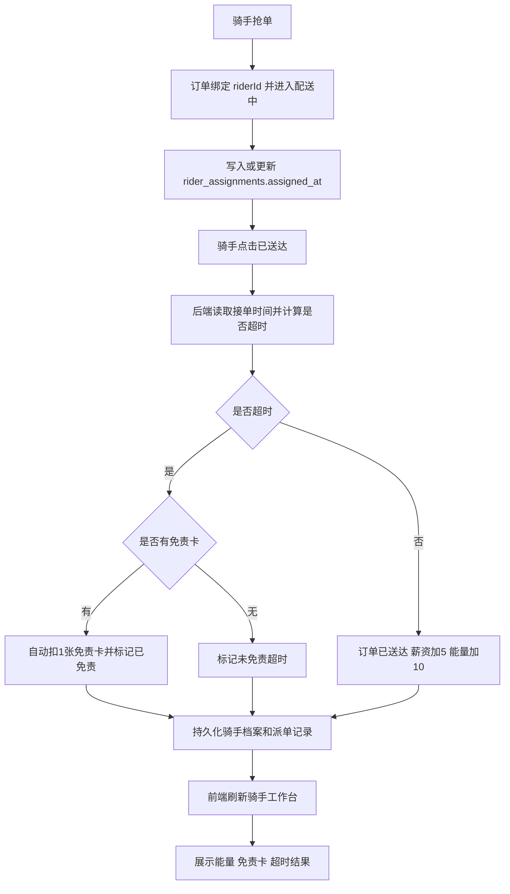

## Product Overview

骑手端新增“服务能量值”和“超时免责卡”能力，让骑手完成配送后获得能量值，并可将能量值兑换为超时免责卡；送达时系统判定是否超时，并按规则自动或手动消耗免责卡。

## Core Features

- 骑手每送达 1 单获得 10 点服务能量值，原有薪资奖励继续保留。
- 骑手可使用 100 点服务能量值兑换 1 张超时免责卡。
- 骑手接单后记录接单时间，送达时按统一配送时长阈值判定是否超时。
- 若送达超时且骑手有免责卡，系统优先自动消耗 1 张并标记本次超时已免责。
- 若送达超时时暂无免责卡，支持后续手动消耗免责卡为未免责超时订单补用。
- 骑手端展示当前能量值、兑换进度、免责卡数量、兑换入口和送达超时处理结果。
- 历史配送中展示超时和免责状态，便于骑手理解每单奖励与免责消耗情况。

视觉效果：在骑手工作台增加醒目的能量权益卡片，使用进度条展示“距离下一张免责卡还差多少能量”，配送任务和历史配送中以标签提示“可能超时”“已超时”“已免责”等状态。

## Tech Stack

- 前端沿用现有 Vite + React + TypeScript + Zustand。
- UI 沿用现有 Tailwind CSS、shadcn 风格组件和 lucide-react 图标。
- API 沿用现有 `APIMessage`、`TaskIO`、`sendAPI` 调用方式。
- 后端沿用 Scala 3.3.3 + http4s + cats-effect + Circe + JDBC + PostgreSQL。
- 数据初始化和兼容升级沿用现有 TableInitializer 模式，使用 `ALTER TABLE ... ADD COLUMN IF NOT EXISTS` 兼容已有本地库。
- 后端遵守项目约束：只新增 `val`，不新增 `var`；业务数据以后端 PostgreSQL 持久化为准。

## Existing Project Findings

- 骑手页面位于 `frontend/src/pages/RiderApp/`，当前包含 `RiderOverview`、`DispatchCard`、`TaskListCard`、`SalaryCard`。
- 骑手状态集中在 `frontend/src/stores/pages/use-rider-app-store.ts`，通过 `fetchRiderMeIO`、`grabRiderOrderIO`、`updateRiderOrderStatusIO` 刷新后端数据。
- 骑手对象前端在 `frontend/src/objects/rider/Rider.ts`、`RiderProfile.ts`，后端在 `backend/src/rider/objects/Rider.scala`、`RiderProfile.scala`。
- 后端送达逻辑在 `backend/src/rider/api/RiderAPIMessages.scala` 的 `RiderUpdateOrderStatusAPIMessage`，当前送达时将订单改为“已送达”并给骑手 `salary + 5`。
- 派单记录表 `rider_assignments` 已有 `assigned_at` 和 `completed_at`，可作为超时判定的接单和完成时间基础，但需要补齐超时、免责持久化字段和查询方法。
- 骑手档案表 `rider_profiles` 当前包含薪资和钱包余额，需要新增能量值、免责卡数量及统计字段。

## Architecture

### Data Flow



### Module Division

- **Rider Profile 数据模块**
- 负责保存骑手能量值、免责卡数量、超时统计。
- 修改 `Rider.scala`、`Rider.ts`、`RiderProfileTable.scala`、`RiderProfileTableInitializer.scala`、`SeedData.scala`。
- 与 `RiderMeAPIMessage` 和前端骑手页面展示集成。

- **Rider Assignment 超时模块**
- 负责保存接单时间、完成时间、是否超时、是否已免责、是否消耗免责卡。
- 修改 `RiderAssignmentTable.scala`、`RiderAssignmentTableInitializer.scala`。
- 新增读取指定骑手订单派单记录的方法，供送达和手动免责流程调用。

- **Rider Reward and Timeout API 模块**
- 负责送达结算、能量奖励、免责卡自动消耗、手动补用、能量兑换。
- 扩展 `RiderAPIMessages.scala`，并在 `RiderRoutes.scala` 注册新增 API。
- 前端新增对应 `frontend/src/api/rider/*Api.ts` 文件并更新 `RiderAPIMessages.ts` 聚合导出。

- **Rider App UI 模块**
- 负责展示能量值、免责卡数量、兑换按钮、兑换进度、超时提示和历史状态。
- 修改 `RiderApp/index.tsx`、`TaskListCard.tsx`，新增 `EnergyTimeoutCard.tsx`。
- 继续通过 Zustand 调用后端，不在浏览器伪造业务状态。

## Implementation Details

### Core Directory Structure

```text
Type-safe_project/
├── backend/src/rider/
│   ├── api/
│   │   └── RiderAPIMessages.scala              # 修改：送达结算、新增兑换和手动免责 API
│   ├── objects/
│   │   ├── Rider.scala                         # 修改：新增 energyPoints、timeoutCardCount 等字段
│   │   ├── RiderDeliverySettlement.scala       # 新增：送达结算返回对象
│   │   └── RiderTimeoutCardRedeemResponse.scala # 新增：兑换返回对象
│   ├── routes/
│   │   └── RiderRoutes.scala                   # 修改：注册新增骑手 API
│   ├── tables/riderprofile/
│   │   ├── RiderProfileTable.scala             # 修改：读写新增骑手字段
│   │   └── RiderProfileTableInitializer.scala  # 修改：新增兼容列
│   ├── tables/riderassignment/
│   │   ├── RiderAssignmentTable.scala          # 修改：保存接单、超时、免责状态
│   │   └── RiderAssignmentTableInitializer.scala # 修改：新增兼容列
│   └── utils/
│       └── RiderTimeoutPolicy.scala            # 新增：统一超时阈值与计算规则
├── frontend/src/
│   ├── api/rider/
│   │   ├── RiderRedeemTimeoutCardApi.ts        # 新增：兑换免责卡
│   │   ├── RiderUseTimeoutCardApi.ts           # 新增：手动补用免责卡
│   │   └── RiderUpdateOrderStatusApi.ts        # 修改：接收送达结算结果
│   ├── objects/rider/
│   │   ├── Rider.ts                            # 修改：新增能量和免责卡字段
│   │   ├── RiderDeliverySettlement.ts          # 新增：送达结算结果
│   │   └── RiderTimeoutCardRedeemResponse.ts   # 新增：兑换结果
│   ├── pages/RiderApp/
│   │   ├── EnergyTimeoutCard.tsx               # 新增：能量与免责卡展示
│   │   ├── index.tsx                           # 修改：接入卡片和提示
│   │   └── TaskListCard.tsx                    # 修改：展示超时和手动免责入口
│   └── stores/pages/
│       └── use-rider-app-store.ts              # 修改：新增兑换和手动免责动作
```

### Key Data Structures

```
final case class Rider(
    id: RiderId,
    name: String,
    phone: String,
    realtimeLocation: String,
    status: RiderStatus,
    totalOrders: Int,
    rating: Double,
    station: String,
    salary: Double,
    energyPoints: Int,
    timeoutCardCount: Int,
    timeoutCount: Int,
    timeoutExemptedCount: Int
)
```

```
final case class RiderDeliverySettlement(
    ok: Boolean,
    orderId: OrderId,
    earnedEnergy: Int,
    currentEnergyPoints: Int,
    currentTimeoutCardCount: Int,
    wasTimeout: Boolean,
    timeoutCardUsed: Boolean,
    timeoutExempted: Boolean,
    overtimeSeconds: Int
)
```

```typescript
export interface Rider {
  id: RiderId
  name: string
  phone: string
  realtimeLocation: string
  status: RiderStatus
  totalOrders: number
  rating: number
  station: string
  salary: number
  energyPoints: number
  timeoutCardCount: number
  timeoutCount: number
  timeoutExemptedCount: number
}
```

### Core Business Rules

- 完成送达奖励：每次成功从“配送中”更新为“已送达”时，骑手 `salary + 5` 且 `energyPoints + 10`。
- 能量兑换：当 `energyPoints >= 100` 时允许兑换，兑换后 `energyPoints - 100` 且 `timeoutCardCount + 1`。
- 超时判定：优先使用 `rider_assignments.assigned_at` 作为接单时间；送达时间使用后端当前时间；固定阈值先放在 `RiderTimeoutPolicy`，例如 45 分钟。
- 自动免责：送达超时且 `timeoutCardCount > 0` 时自动扣减 1 张，并记录该订单 `timeout_exempted = true`、`timeout_card_used = true`。
- 手动补用：对已送达、已判定超时、尚未免责的本人订单，若当前有免责卡，可手动扣减 1 张并更新派单记录。
- 幂等保护：已送达订单不能重复结算；已免责订单不能重复消耗卡；兑换接口需校验能量余额。

### Technical Implementation Plan

1. **数据持久化扩展**

- 在 `rider_profiles` 新增能量、免责卡和统计列。
- 在 `rider_assignments` 新增超时和免责列。
- 更新表读写逻辑和种子数据，保证旧数据有默认值。

2. **送达结算链路**

- 在 `RiderUpdateOrderStatusAPIMessage` 中读取派单记录。
- 使用 `RiderTimeoutPolicy` 判断是否超时。
- 统一更新订单状态、骑手薪资、能量、免责卡和派单记录。
- 返回 `RiderDeliverySettlement` 供前端展示明确提示。

3. **兑换和手动免责 API**

- 新增 `RiderRedeemTimeoutCardAPIMessage`，处理 100 能量兑换 1 张卡。
- 新增 `RiderUseTimeoutCardAPIMessage`，处理已超时订单的手动补用。
- 更新 `RiderRoutes.scala` 注册并补齐前端 API 文件。

4. **前端状态和交互**

- Zustand store 新增 `redeemTimeoutCard`、`useTimeoutCard`。
- 送达接口返回结算结果后展示“获得能量”“超时已自动免责”等通知。
- 所有交互完成后重新拉取 `RiderMe`，保持页面以后端数据为准。

5. **骑手端 UI**

- 新增 `EnergyTimeoutCard` 展示能量、卡数、兑换进度和兑换按钮。
- `TaskListCard` 展示配送任务的超时风险提示和历史订单的超时免责状态。
- 保持现有橙色配送主题，与 `SalaryCard` 和 `RiderOverview` 视觉一致。

### Testing Strategy

- 后端编译：运行 `cd backend && sbt -batch compile`。
- 前端类型检查：运行 `cd frontend && npm run typecheck`。
- 手动验证场景：
- 正常送达：薪资加 5、能量加 10、不扣卡。
- 超时且有卡：薪资加 5、能量加 10、自动扣 1 张卡并标记已免责。
- 超时且无卡：记录未免责超时，之后兑换卡并手动补用成功。
- 能量不足兑换：后端返回明确错误，前端展示失败提示。
- 重复送达或重复补用：后端拒绝，避免重复奖励或重复扣卡。

## Integration Points

- 前端与后端通信仍使用 JSON APIMessage。
- 骑手认证沿用现有 JWT 和 `APIWithRoleMessage` 的 rider 角色校验。
- 不引入新的第三方服务。
- 数据一致性以 PostgreSQL 为准，前端不使用 localStorage 或内存状态模拟真实能量和卡数量。

## Design Approach

在现有骑手工作台中新增一个“能量与免责卡”权益卡片，不重做整体页面结构。卡片放置在骑手概览之后、抢单和配送任务之前，形成“身份状态 → 权益资产 → 可抢订单 → 当前任务 → 收入”的阅读顺序。

## Screen Planning

### 骑手工作台

- **顶部概览区**：保留骑手姓名、状态、累计接单，增加轻量图标和更清晰的数值层级。
- **能量权益卡片**：左侧显示当前能量值，右侧显示免责卡数量，中间用渐变进度条展示兑换进度。
- **兑换操作区**：当能量达到 100 时按钮高亮可点击；不足时按钮置灰并显示还差多少能量。
- **规则说明区**：用简短文案说明“送达 1 单 +10 能量，100 能量换 1 张免责卡”。
- **配送任务区**：待送达订单保留“已送达”按钮，补充预计超时风险标签。
- **历史配送区**：每单展示“准时送达”“超时已免责”“超时未免责”，未免责时显示手动补用入口。

## Interaction

按钮使用橙色到琥珀色渐变；兑换成功后通过现有 notice 展示反馈。超时标签使用红橙色，已免责标签使用绿色，增强状态辨识度。卡片 hover 时轻微上浮，进度条具备柔和过渡动画。

## Agent Extensions

### SubAgent

- **code-explorer**
- Purpose: 复核骑手端、订单、派单记录、API 与对象文件的完整影响范围。
- Expected outcome: 确认修改点不遗漏，并避免破坏现有结算、抢单和 RiderMe 数据流。

### Skill

- **type-safety-audit**
- Purpose: 审计新增骑手能量、免责卡、超时 API 与对象的前后端契约一致性。
- Expected outcome: 验证 API message、objects、枚举、ID 类型和前端状态没有越权替代后端逻辑。